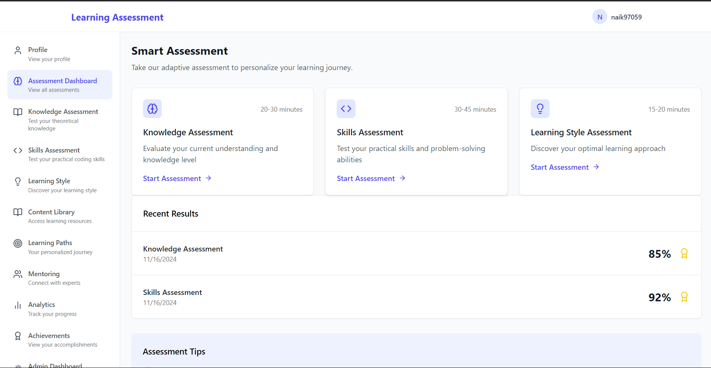
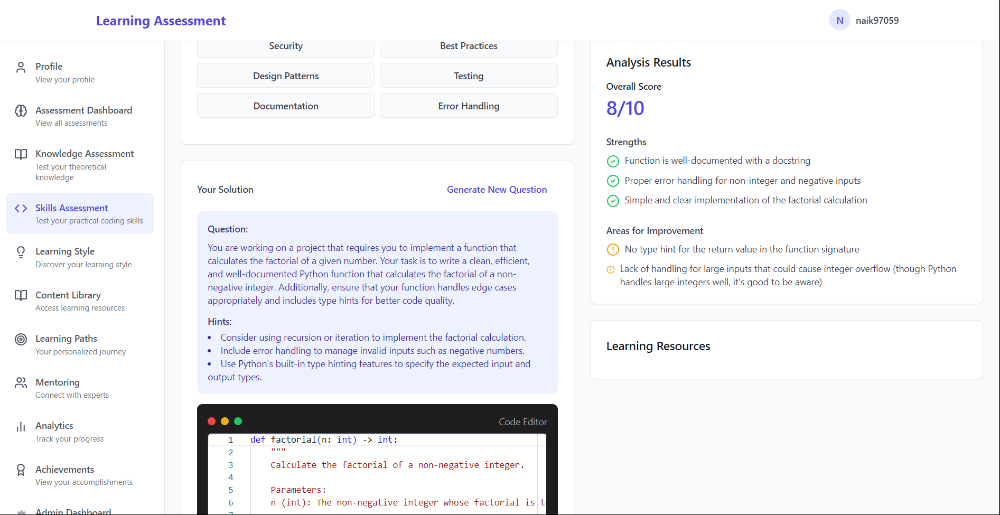

# 🎓 Adaptive Learning Assessment Platform

<div align="center">

[](https://github.com/ManojINaik/Ai-learning/blob/main/LICENSE)
[](https://github.com/ManojINaik/Ai-learning/stargazers)
[](https://github.com/ManojINaik/Ai-learning/issues)
[](https://github.com/ManojINaik/Ai-learning/network)

<p align="center">
  
</p>

An intelligent, AI-powered learning assessment platform that adapts to your knowledge level and provides personalized feedback for continuous improvement.

[Demo](https://github.com/ManojINaik/Ai-learning) • [Report Bug](https://github.com/ManojINaik/Ai-learning/issues) • [Request Feature](https://github.com/ManojINaik/Ai-learning/issues)

</div>

## 📸 Screenshots

<div align="center">
  
  <p><em>Dashboard - Track your learning progress</em></p>
  
  
  <p><em>Assessment Interface - AI-powered question generation</em></p>
  
  
  <p><em>Detailed Feedback - Personalized learning insights</em></p>
</div>

## ✨ Features

<div align="center">
  <table>
    <tr>
      <td align="center">🧠 <b>AI-Powered Questions</b></td>
      <td align="center">📊 <b>Skill Assessment</b></td>
      <td align="center">🎯 <b>Adaptive Difficulty</b></td>
    </tr>
    <tr>
      <td align="center">📝 <b>Multi-Domain Support</b></td>
      <td align="center">🔄 <b>Real-time Feedback</b></td>
      <td align="center">📈 <b>Progress Tracking</b></td>
    </tr>
  </table>
</div>

## 🛠️ Tech Stack

<div align="center">
  
  
  
  
  
</div>

## 📋 Prerequisites

- Node.js (v16 or higher)
- npm or yarn
- GLHF Chat API key

## 🚀 Quick Start

1. **Clone the repository**
   ```bash
   git clone https://github.com/ManojINaik/Ai-learning.git
   cd Ai-learning
   ```

2. **Install dependencies**
   ```bash
   npm install
   ```

3. **Set up environment variables**
   ```env
   # GLHF Chat API Configuration
   VITE_GLHF_API_KEY=your_glhf_api_key_here
   VITE_GLHF_API_URL=https://glhf.chat/api/openai/v1
   ```

4. **Start development server**
   ```bash
   npm run dev
   ```

## 🏗️ Project Structure

```
project/
├── 📁 src/
│   ├── 📁 api/           # API endpoints
│   ├── 📁 components/    # Reusable components
│   ├── 📁 config/       # Configuration files
│   ├── 📁 contexts/     # React contexts
│   ├── 📁 hooks/        # Custom hooks
│   ├── 📁 pages/        # Page components
│   ├── 📁 services/     # Business logic
│   ├── 📁 styles/       # Global styles
│   └── 📁 types/        # TypeScript types
└── 📁 public/           # Static assets
```

## 🔑 Key Features

<details>
<summary><b>Knowledge Assessment</b></summary>

- Domain-specific question generation
- Multiple choice questions
- Immediate feedback
- Progress tracking
</details>

<details>
<summary><b>Skills Assessment</b></summary>

- Code quality analysis
- Performance evaluation
- Security assessment
- Best practices review
</details>

<details>
<summary><b>Learning Resources</b></summary>

- Personalized recommendations
- Strength/weakness analysis
- Next-step guidance
</details>

## 🧪 Testing

```bash
npm test
```

## 🔒 Security & Known Issues

- ✅ Environment variables for API keys
- ✅ Input validation and sanitization
- ⚠️ Requires stable internet connection
- ⚠️ Occasional AI response parsing issues

## 🔮 Roadmap

1. 🎯 Advanced AI prompt engineering
2. 🎯 Enhanced difficulty selection
3. 🎯 Nuanced assessment feedback
4. 🎯 Question caching system
5. 🎯 Improved error recovery
6. 🎯 User progress tracking

## 🤝 Contributing

1. Fork the repository
2. Create feature branch (`git checkout -b feature/AmazingFeature`)
3. Commit changes (`git commit -m 'Add AmazingFeature'`)
4. Push to branch (`git push origin feature/AmazingFeature`)
5. Open a Pull Request

## 👤 Author

**Manoj Naik**
- GitHub: [@ManojINaik](https://github.com/ManojINaik)

## 🙏 Acknowledgments

- GLHF Chat for AI capabilities
- React and TypeScript communities

<div align="center">

Made with ❤️ by [Manoj Naik](https://github.com/ManojINaik)

</div>
