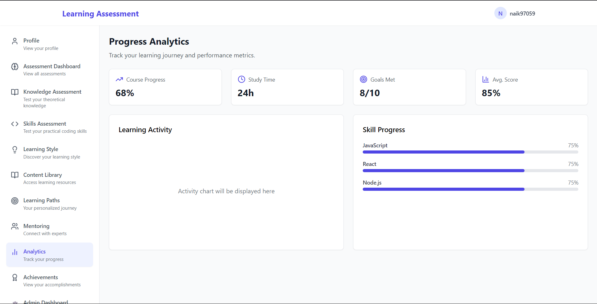
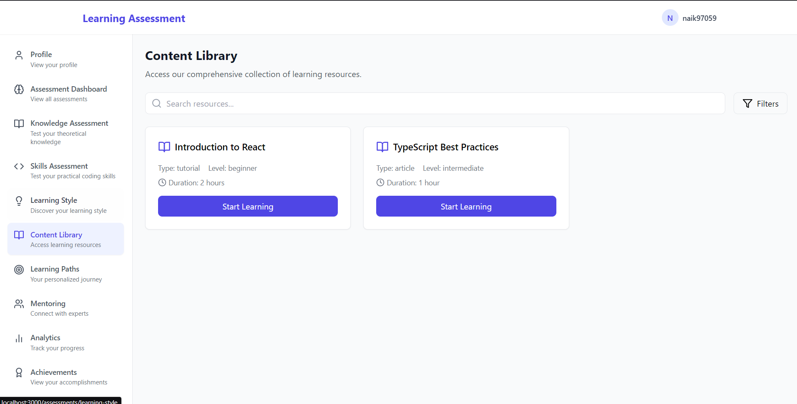

# Learning Assessment Platform

A comprehensive platform for assessing and improving programming skills through interactive assessments and real-time feedback.

<div align="center">

[](https://github.com/ManojINaik/Ai-learning/blob/main/LICENSE)
[](https://github.com/ManojINaik/Ai-learning/stargazers)
[](https://github.com/ManojINaik/Ai-learning/issues)
[](https://github.com/ManojINaik/Ai-learning/network)

<p align="center">
  
</p>

## Features

### For Students
- **Skill Assessment**: Take programming assessments in various languages and domains
- **Knowledge Testing**: Test theoretical understanding of programming concepts
- **Real-time Feedback**: Get instant feedback on your code submissions
- **Progress Tracking**: Monitor your learning progress over time
- **Personalized Learning Path**: Get recommendations based on your performance

### For Teachers
- **Assessment Creation**: Create custom assessments for students
- **Performance Monitoring**: Track student progress and identify areas for improvement
- **Automated Grading**: Automatic evaluation of student submissions
- **Detailed Analytics**: Access comprehensive reports on student performance

### For Administrators
- **User Management**: Add, view, and manage users through an intuitive admin dashboard
- **Domain Management**: Add and remove programming domains and topics
- **Assessment Management**: Organize and manage all assessments
- **Admin Assistant**: AI-powered chatbot for quick administrative tasks
  - View user statistics and performance
  - Manage domains and users through chat commands
  - Access assessment results and analytics
  - Monitor platform usage

### Technical Features
- **Firebase Integration**: Secure authentication and real-time database
- **AI-Powered Analysis**: Advanced code analysis and feedback
- **Responsive Design**: Works seamlessly across devices
- **Real-time Updates**: Instant updates for assessments and results

## Screenshots

<div align="center">
  
  <p><em>Dashboard - Track your learning progress</em></p>
  
  
  <p><em>Assessment Interface - AI-powered question generation</em></p>
  
  
  <p><em>Content Library - Content Library</em></p>
</div>

## Getting Started

1. **Clone the repository**
   ```bash
   git clone https://github.com/ManojINaik/Ai-learning.git
   cd Ai-learning
   ```

2. **Install dependencies**
   ```bash
   npm install
   ```

3. **Set up environment variables**
   ```env
    VITE_FIREBASE_API_KEY=<your-api-key>
    VITE_FIREBASE_AUTH_DOMAIN=<your-api-key>
    VITE_FIREBASE_PROJECT_ID=<your-api-key>
    VITE_FIREBASE_STORAGE_BUCKET=<your-api-key>
    VITE_FIREBASE_MESSAGING_SENDER_ID=<your-api-key>
    VITE_FIREBASE_APP_ID=<your-api-key>
    VITE_FIREBASE_MEASUREMENT_ID=<your-api-key>
    
    # GLHF API Configuration
    VITE_GLHF_API_KEY=<your-api-key>
    VITE_GLHF_API_URL=https://glhf.chat/api/openai/v1
   ```

4. **Start development server**
   ```bash
   npm run dev
   ```

## Admin Assistant Commands

The Admin Assistant chatbot supports the following commands:

### User Management
- `show all users` or `list users`: View all users in the system
- `show statistics`: View platform usage statistics
- `delete user [email]`: Remove a user from the system

### Domain Management
- `show domains` or `list domains`: View all available domains
- `add domain [name]`: Add a new programming domain
- `add domain [name] [description]`: Add a domain with description
- `delete domain [name]`: Remove a domain

### Assessment Management
- `show assessments` or `assessment stats`: View assessment statistics
- `show results` or `result stats`: View assessment result statistics
- `show results for [userId]`: View results for a specific user

## Tech Stack

- **Frontend**: React, TypeScript, Tailwind CSS
- **Backend**: Firebase (Authentication, Firestore)
- **APIs**: GLHF Chat API for code analysis
- **State Management**: React Context
- **UI Components**: Custom components with Tailwind

## Project Structure

```
project/
├── 📁 src/
│   ├── 📁 api/           # API endpoints
│   ├── 📁 components/    # Reusable components
│   ├── 📁 config/       # Configuration files
│   ├── 📁 contexts/     # React contexts
│   ├── 📁 hooks/        # Custom hooks
│   ├── 📁 pages/        # Page components
│   ├── 📁 services/     # Business logic
│   ├── 📁 styles/       # Global styles
│   └── 📁 types/        # TypeScript types
└── 📁 public/           # Static assets
```

## Contributing

1. Fork the repository
2. Create your feature branch (`git checkout -b feature/AmazingFeature`)
3. Commit your changes (`git commit -m 'Add some AmazingFeature'`)
4. Push to the branch (`git push origin feature/AmazingFeature`)
5. Open a Pull Request

## License

This project is licensed under the MIT License - see the [LICENSE](LICENSE) file for details.

## Author

**Manoj Naik**
- GitHub: [@ManojINaik](https://github.com/ManojINaik)

## Acknowledgments

- GLHF Chat for AI capabilities
- React and TypeScript communities

<div align="center">

Made with ❤️ by [Manoj Naik](https://github.com/ManojINaik)

</div>
